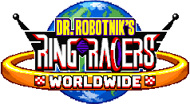

# Ring Racers Worldwide

**Client-side prediction netcode for [Dr. Robotnik's Ring Racers](https://www.kartkrew.org).**
An unofficial fork, maintained by Gibax.

  

> **Experimental: there is no release yet.** The prediction runs only on a
> server that hosts in WORLDWIDE mode, most measurements so far come from one
> driver on one machine, and what is known to be missing is listed under
> [Where it stands](#where-it-stands).
>
> **This project is AI-assisted.** How, and why, is explained under
> [About AI](#about-ai).
>
> This fork is not affiliated with or endorsed by Kart Krew Dev: please report
> its bugs [here](#reporting-a-problem), never to them.

## Why

Stock Ring Racers plays online in lockstep: nobody's input is applied until
the server has it, so every player feels their own ping as input delay. Ring
Racers Worldwide keeps the server authoritative and the game deterministic,
and hides the round trip instead: your kart answers your input on the next
tic, the world you see is a prediction a few tics ahead of what the server has
confirmed, and the server's word corrects it.

It is **client-side prediction with server reconciliation**, not GGPO-style
peer-to-peer rollback: the game keeps its authoritative server and its
consistency check.

The goal is a community one: letting people race on servers far from them --
a European on an American server, for a start -- in a game as demanding as
Ring Racers.

## How it works

- **Two clocks.** The confirmed world (`gametic`) runs only the tics the
  server has confirmed, in the stock lockstep, untouched. On top of it, a
  *speculation* runs ahead from a snapshot of the confirmed world, with your
  own inputs applied at once. The speculation is what you see.
- **Snapshots.** The confirmed world is saved as a raw copy of the level's
  object pools in memory and restored before each confirmed tic, so the
  speculation never leaks into it. A large part of the work has been finding
  and fixing every piece of state a restore did not put back exactly.
- **Keeping what was right.** When the server confirms the inputs a
  speculation ran, it is kept and extended by a tic instead of rebuilt. Your
  inputs still in flight are replayed on the tics the server will give them.
- **Guessing the others.** Bots are recomputed from the local world, which is
  exact; a remote person's last input is repeated until the real one arrives.
- **A light correction channel.** Instead of the stock full-state resend
  (hundreds of KB and a visible hitch when a client parts from the server),
  the server sends each client a small packet with every kart's state a few
  times a second.
- **The server decides.** A server hosting with `worldwide On`, the default,
  advertises the mode, runs the correction channel, and accepts WORLDWIDE
  clients only. A
  WORLDWIDE client turns its prediction on when it joins such a server, and
  plays the stock netcode, as a stock client, everywhere else.

## Where it stands

Measured on two instances on one machine (a Ryzen 5 5600X) with simulated
latency, one human driver and bots, unless said otherwise:

- **Input lag is gone** from the client's seat, at every latency tried from
  0 to 428 ms.
- **The confirmed world stays exact**: 0.000 units of drift on every kart in
  every driven race since the end of September, and no full-state resend.
- **The picture is smooth**: your kart is drawn in even steps, as without
  prediction.
- **It fits a full grid**: sixteen karts on Opulence, a heavy map, to the end
  of the race, at 6 to 7 ms of prediction work per tic -- under a quarter of
  a tic.
- **It lives next to stock 2.4**: a stock client is refused by a WORLDWIDE
  server with a message saying why; a WORLDWIDE build joins stock servers and
  hosts stock clients as a stock 2.4 would.
- **First race from a second machine**: a Steam Machine running the Flatpak
  build joined a WORLDWIDE server over a LAN and raced to the finish.

**Not done yet:** two people racing each other on separate machines; a real
Internet connection, with jitter and packet loss (the bench only delays);
round trips above about 340 ms; smaller machines; items used on purpose;
most maps; Battle, Grand Prix and Encore.

The measurement journal, with every figure and the prediction written before
each run, is [docs/WORLDWIDE.md](docs/WORLDWIDE.md) -- its *Current state*
block first.

## What this fork adds

| Feature | Console switch | State |
|---|---|---|
| WORLDWIDE mode: one server switch, clients follow, stock clients refused | `worldwide` (server; also in the menus) | measured, checked against stock 2.4 |
| Two-clock prediction, your own input applied at once | `rollback_twoclock` | measured, on in WORLDWIDE mode |
| Speculation that never writes over tics already received | `rollback_cleancmds` | measured, on by default |
| Replaying your inputs still in flight | `rollback_history`, `rollback_histreal` | measured, on in WORLDWIDE mode |
| Keeping the speculation when the server confirms it | `rollback_keepspec` | measured, on in WORLDWIDE mode |
| Light state-correction channel in place of full resends | `rollback_correct` (server) | measured, on in WORLDWIDE mode |
| Raw snapshots of the level's object pools | `rollback_rawsnap` | measured, on by default |
| No chain of rebuilds after a stall of the client | `rollback_ontime` | measured, on in WORLDWIDE mode |
| Smooth drawing between kept passes | -- | measured |
| Each sound heard once, and heard after a join | `rollback_soundreset` | heard, on by default |
| No fixed input delay for the host or clients while predicting | -- | measured |
| A cap on a rebuild's cost, for smaller machines | `rollback_rebuildbudget` | measured, off by default |
| Restore fixes: item roulette, polyobjects, dynamic slopes, ACS references, kart reference counts, and more | -- | measured |
| Diagnostics: snapshot and leak soaks, drift and blame logs, cost per pass, unattended test races | `rollback_test`, `rollback_soak`, `rollback_drift`, ... | in use |
| Not netcode: typing with the system's keyboard layout (AZERTY and others) | `textinput` | checked |
| Not netcode: WORLDWIDE's title screen, window title and icon | -- | in use |
| Not netcode: character dubs -- each pilot's voice set per character, "Japanese" say; online in WORLDWIDE mode only | `pilotdubs`, `voicelanguage`, `dublist` | played offline and in splitscreen, 2.4 builds |
| Not netcode: two-player splitscreen side by side | `split2p` (*Options > HUD*) | played, 2.4 builds |
| Not netcode: photo mode -- the game held, the HUD hidden, a free camera | the pause menu | played, 2.4 builds |
| Not netcode: steering by tilting a controller with motion sensors, each profile's | `profilegyro` (*Profiles > Accessibility*) | played, 2.4 builds |

What the *Not netcode* features do, and how to set them, is under
[Beyond the netcode](#beyond-the-netcode). Every switch, with what it does,
is in [docs/COMMANDS.md](docs/COMMANDS.md). The order of the work left is in
[docs/ROADMAP.md](docs/ROADMAP.md).

## Where it's going

1. **A second person**: two people on two machines, on a LAN, then over the
   Internet, then one of them hosting.
2. **A real network** in the test bench, with jitter and loss, and the
   samples filed by sequence number if the current scheme slips under it.
3. **Deep round trips**: a history long enough for the players of a truly
   worldwide lobby.
4. **Breadth**: items used on purpose, more maps of every kind.
5. **A public alpha**: a download on a GitHub release (Windows, a Linux
   tarball and a Flatpak), a short install guide for Windows, Linux and the
   Steam Deck, a place to report and send logs, and a plain list of what is
   known to be broken.

## About AI

### A word from Gibax

**This project is AI-assisted, and there is no need to pretend otherwise.**

I don't agree with using AI for art. Placeholder art on a small indie project
is the one use I can defend: not everyone can pay an artist. Hell, I did it
myself: the custom font of the "WORLDWIDE" lettering was made with AI. Every
other piece of art here is human-made -- and badly, at that.

I fully expect people to be disappointed and leave the moment they see "AI"
on this project. I don't blame them: with how much slop AI has brought, I can
only understand. Still, I do believe this project is one of the few decent
ones. That is not my call to make, though. So I'm asking you to at least try
it, and then decide whether it's truly slop or not.

I also know how the SRB2 Message Board and the SRB2 community see AI, and that
it is mostly negative, largely because of art theft. But I'll be honest: as a
programmer, I don't see generative AI as a horrible thing for coding. Art and
other creative media are an entirely different subject, but I do believe AI is
helpful for code, and that in the hands of someone who knows what they're
doing, it can genuinely help programmers on difficult projects.

I am **not** associated with Kart Krew or Sonic Team Jr. This is a purely
independent fork. I don't want to be associated with them because of my use
of AI: I don't know their view on it, and I don't want my choices to drag
them into a shitstorm. I think I've made my stance clear, and I completely
understand if they don't support this project at all because of its use of
AI. But I won't take it down because they don't like it: the code is open
source, under the GNU General Public License, which lets anyone modify it and
share it as long as the result is published under the same license -- and
that is exactly what this fork does. That said, I am fully open to
constructive criticism on this, and anyone is welcome to take this work and
rework it their own way.

Over the years, and despite the games' popularity, I haven't seen anyone take
on the delay-based netcode inherited from Doom Legacy. It has clearly shown
its age, especially now that fast-paced games are everywhere and rollback
patches are being applied to everything (and thank god for that -- BBCF, my
beloved). Sure, there have been a few improvements along the way, but other
than that, it is pretty much the same stock lockstep, delay-based netplay as
SRB2's.

The closest thing to this I've seen is SRB2 NetPlus by LXShadow: a first step
toward client-side prediction, but a client-only fix, with plenty of room for
desyncs. Inspired by it, I decided to put some of my knowledge on the subject
to good use, and to modify Ring Racers' netcode to implement client-side
prediction, to smooth out the gameplay, especially at higher pings.

To be fair, though, my knowledge of C and C++ is pretty bare, just the
minimum, and a project of this scale was not something easy to take on alone.
I also wanted to test the limits of AI on this kind of project (sadly, with
the state of the programming world, it is becoming clear that you need it
just to compete). So at first it was only a test, to see how far AI could
take a project like this. After a while, it became a serious project I wanted
to spend time on and perfect.

Do I expect a ton of bugs and problems? Yes. In fact, I want people to report
the bugs and problems they run into: I want this fork to be the best it can
be, and for that I need your help. Will people boycott it because it's AI?
Probably, yes. Sadly, I expect it to flop hard, despite the real step forward
it brings to the SRB2 engine in general.

Thank you, Kart Krew, for your dedicated work throughout the years. I love
SRB2Kart, I've started to love Ring Racers, and despite what I said above,
which may have sounded negative: if anyone on the team could test this and
report bugs or give constructive criticism, it would be far more than I could
ever have asked for. I don't need praise; I just want to make a decent
product for the players. But if you decide to boycott it instead, and
(probably rightfully) judge it as "AI slop", I completely understand, and I
won't hold it against you, or against anyone else for that matter.

If you've read this far: first of all, thank you. I want you to know that I
did this for the love of the game, for the love of SRB2 and Ring Racers. I'm
not trying to take any credit or fame from it -- frankly, I don't care about
that. This was just a project for fun, and I wanted to share it with the
world.

-- Gibax

### How the AI is used, in practice

The assistant is Anthropic's Claude, through Claude Code, working under rules
written into the repository's agent instructions:

- **The AI assists; Gibax decides.** It reads the Ring Racers code base,
  traces a mechanism down to a line, writes code and test instruments, and
  drafts the documentation. Choosing between solutions, and what is kept or
  dropped, is Gibax's.
- **Nothing runs without Gibax's go-ahead, every time.** Gibax runs the tests
  and drives the races: the feel of a race is judged by a person, never
  inferred from a log.
- **Measure, don't assume.** Every change is tested on a binary verified by
  its hash, with the prediction written down *before* the run and a control
  in the same session.
- **Mistakes stay visible.** The journal is annotated, never rewritten: when
  a later result overturns an earlier one, the earlier one gets a pointer
  forward. Many of the wrong predictions in it are the AI's.
- **Commits written with the AI say so** in their trailer.

## Trying it

There is no release yet. Every push is built by GitHub Actions (see
[.github/workflows/build.yml](.github/workflows/build.yml)), and the builds
are the runs' artifacts: downloading one needs a GitHub account, and they
expire after 90 days.

The main branch, **`worldwide-2.4`**, is built on the Ring Racers 2.4
release: its builds play with stock 2.4 servers and clients, and it is the
base of the coming alpha.

- `ringracers-win64-release-<sha>`: Windows. Put the executable in an
  existing Ring Racers 2.4 folder.
- `ringracers-linux64-release-<sha>`: a Linux tarball, unpacked into a 2.4
  data folder; it uses the system's SDL2.
- `ringracers-flatpak-<sha>`: a Flatpak, which reads the data of the official
  Ring Racers Flatpak from Flathub: install that one first.

The `-release` builds carry real version numbers; the others are development
builds, which can only meet the very same build. A feature in progress lives
on a side branch named after it (`dubs-2.4`, `photo-2.4`...) until it is
tried and merged.

**To host in WORLDWIDE mode**, just host: it is on by default. **To host
for stock 2.4 players**, turn off *Options > Server Options > Advanced... >
Network Connection > WORLDWIDE Mode*, or start the game with
`+worldwide Off`, **before** anybody joins. A config saved by an earlier
build keeps the Off it saved: turn the mode on once in that menu. **To
join**, just connect: a WORLDWIDE client switches its prediction on by
itself. A WORLDWIDE build meets the same WORLDWIDE builds only: an older
or newer one is told which side to update.

## Beyond the netcode

Features of the `worldwide-2.4` builds that have nothing to do with the
netcode. Each is a setting saved in the game's config.

### Character dubs

A character can have more than one voice -- Sonic in Japanese, say -- and
each pilot chooses theirs.

- **Choosing.** At character select, a character that has dubs gets one more
  step before the colours: *Default*, the game's voice, then each dub
  loaded, each heard as it comes up. The choice is kept, for that character,
  with the profile you race with (`pilotdubs`).
- **Everyone else.** *Options > Sound > Voice Language* (`voicelanguage`,
  `Default` by default) is the voice heard for bots, replays and pilots who
  chose none.
- **Checking.** The console command `dublist` lists the dubs loaded, your
  choices, and what the other pilots' machines said.

**Installing a pack.** Put it in the `dubs` folder, next to `addons`: the
game's folder on Windows,
`~/.var/app/io.github.ringracers_worldwide.RingRacersWorldwide/.ringracers/dubs`
with the Flatpak -- the game makes the folder at its first start. The packs
there load at start-up, on this machine alone: a dub pack never enters a
server's file list, is never sent to anyone, and does not make the game
count as modified, so you can join any server with your dubs loaded, a stock
one included. A pack holding anything but sounds and `DUBDEF` lumps is left
out, with a warning in the console.

**Online.** In WORLDWIDE mode, your choice -- the character's and the dub's
names, never the sounds -- reaches the other players: they hear your kart in
your dub if they have the same pack, and in the character's own voice if they
don't. On a stock server nothing is sent: your kart speaks with your dub, the
others with your *Voice Language*. A voice is not part of the game's state,
so different dubs cannot desync anyone. Not yet tried online.

**Making a pack.** A WAD or PK3 of sounds, with one `DUBDEF` lump per
character and dub, written as an S_SKIN's sound lines:

    skin = sonic
    name = Japanese
    DSKWIN = DSSNJWIN
    DSKLOSE = DSSNJLOS

- The twelve voice lines are `DSKWIN`, `DSKLOSE`, `DSKHURT1`, `DSKHURT2`,
  `DSKATTK1`, `DSKATTK2`, `DSKBOST1`, `DSKBOST2`, `DSKSLOW`, `DSKHITEM`,
  `DSKGLOAT` and `DSKTALK`. A line the dub leaves out stays the character's
  own.
- A sound lump's name is `DS` and six characters at most, as for any sound.
- A dub's name is a single word, without spaces.
- Up to 128 dubs, under 32 different names.

**Dubs for addon characters.** A `DUBDEF` can name a character that is not
loaded yet: the dub waits in memory, under the character's name, and applies
as soon as the character is loaded -- by `addfile`, or downloaded from a
server -- its step at character select included. Two things to get right:

- `skin =` is the addon's internal name, the `name` of its S_SKIN, not the
  one shown in the menus (case does not matter). A dub whose name matches no
  character stays unused; `dublist` still shows it.
- Give the dub's sound lumps names of their own: the game plays the most
  recently loaded lump of a name, so an addon loaded after the pack with a
  lump of the same name would be heard instead.

Read in the code; not yet tried with an addon character.

### Two players side by side

*Options > HUD > 2P Splitscreen* (`split2p`): `Horizontal`, the game's one
view above the other, or `Vertical`, side by side. Side by side, each view
takes the 3P/4P layout of the HUD, with the item box, the ring counter and
the position at their 2P size in its corners. Not looked at yet: OpenGL,
Battle, the end-of-race tally.

### Photo mode

*PHOTO MODE*, in the pause menu, holds the game, hides the HUD and lets the
camera go free; *LEAVE PHOTO MODE*, in the same menu, puts everything back.
Offline and in replays only: nothing can hold a netgame.

### Gyro steering

For a controller with motion sensors: tilt it like a wheel to steer. It is
each profile's own, under *Options > Profile Setup*, the profile,
*Accessibility*:

- *Gyro Steering*: `Off`, `On` or `Inverted`.
- *Gyro Range*: how far to tilt for a full turn, 30 degrees by default.

The stick and the d-pad come first: tilting steers only while they are left
alone. The log says, for each controller opened, whether the game sees an
accelerometer and a gyroscope; one that Steam Input shows as a plain
controller has none.

### Your keyboard layout

The console, the chat and the menus' text boxes type with your system's
keyboard layout -- AZERTY and the others -- as SRB2 2.2.15 does; the game's
controls do not change. *Options > HUD > Online Chat Options... > Use System
Keyboard Layout* (`textinput`), on by default. ASCII only: the game's fonts
stop there.

### WORLDWIDE's title screen

An optional `worldwide.pk3` gives the title screen WORLDWIDE's Earth and
ring, and removes a stray pixel above Sonic's head in 19 of his frames; the
game runs the same without it. The Flatpak carries it; for Windows and the
Linux tarball, put
[assets/worldwide.pk3](https://github.com/GibaxLeGrand/RingRacers_Worldwide/blob/worldwide-2.4/assets/worldwide.pk3)
from the `worldwide-2.4` branch in the game's `data` folder. The window's
title and icon are WORLDWIDE's in every build.

## Reporting a problem

Open an [issue](https://github.com/GibaxLeGrand/RingRacers_Worldwide/issues)
on this repository: what happened, on which map, with how many players, and
the `latest-log.txt` from the game folder. Please never report this fork's
bugs to Kart Krew.

## Building from source

Ring Racers Worldwide builds like Ring Racers 2.4: CMake, a C17/C++20
toolchain (GCC, Clang, MinGW), and SDL2 among its dependencies. The recipes
below are the ones the CI runs.

### Linux

On Ubuntu 22.04, the recipe of the playable Linux builds:

    apt-get install build-essential cmake ninja-build git pkg-config \
        libsdl2-dev libpng-dev zlib1g-dev libcurl4-openssl-dev libopus-dev
    cmake -B build -S . -G Ninja -DCMAKE_BUILD_TYPE=RelWithDebInfo \
        -DSRB2_CONFIG_ENABLE_WEBM_MOVIES=OFF -DSRB2_CONFIG_DEV_BUILD=OFF
    cmake --build build

On Alpine Linux (3.20), the CI's compile check:

    apk add build-base cmake samurai zlib-dev libpng-dev curl-dev opus-dev \
        sdl2-dev git
    cmake -B build -S . -G Ninja -DCMAKE_BUILD_TYPE=Debug \
        -DSRB2_CONFIG_DEV_BUILD=ON -DSRB2_CONFIG_ENABLE_WEBM_MOVIES=OFF \
        -DSRB2_CONFIG_EXECINFO=NO
    cmake --build build/

The Flatpak is built from Kart Krew's Flathub manifest, in
[.github/flatpak/](.github/flatpak/).

### Windows

The CI cross-compiles from Linux with [llvm-mingw](https://github.com/mstorsjo/llvm-mingw)
against Kart Krew's prebuilt Windows dependencies (the `rrsdk-msys2-clang64`
package, checked against a known SHA-256), and against SDL2 built with the
same toolchain and linked statically, since that package carries SDL3; the
toolchain file and the exact flags are in
[.github/workflows/build.yml](.github/workflows/build.yml).

Upstream documents another route, not tried on this fork: install
[vcpkg](https://vcpkg.io/en/), set `VCPKG_ROOT`, and use a
[CMake preset](https://cmake.org/cmake/help/latest/manual/cmake-presets.7.html)
from `CMakePresets.json`, for example:

    cmake --preset ninja-x86_mingw_static_vcpkg-develop
    cmake --build --preset ninja-x86_mingw_static_vcpkg-develop

`SRB2_CONFIG_DEV_BUILD=ON` gives the development build (version 0, extra
checks), `OFF` the release configuration.

## Upstream

Dr. Robotnik's Ring Racers is a kart racing video game by Kart Krew Dev,
originally based on the 3D Sonic the Hedgehog fangame
[Sonic Robo Blast 2](https://srb2.org/), itself based on a modified version of
[Doom Legacy](http://doomlegacy.sourceforge.net/). Its primary source
repository is [hosted on gitlab.com](https://gitlab.com/kart-krew-dev/ring-racers).

- [Kart Krew Dev Website](https://www.kartkrew.org/)
- [Kart Krew Dev Discord](https://www.kartkrew.org/discord)
- [SRB2 Forums](https://mb.srb2.org/)

## Disclaimer

Dr. Robotnik's Ring Racers is a work of fan art made available for free without intent to profit or harm the intellectual property rights of the original works it is based on. Kart Krew Dev is in no way affiliated with SEGA Corporation. We do not claim ownership of any of SEGA's intellectual property used in Dr. Robotnik's Ring Racers.

Ring Racers Worldwide is an unofficial modification of Dr. Robotnik's Ring Racers, made under the same terms. It is not affiliated with or endorsed by Kart Krew Dev or SEGA.

## License

Ring Racers' source code, and this fork's, is available under the GNU General
Public License version 2.0 or higher. Contributions must be made available
under the GPL version 2.0, or public domain; integrations of third-party code
must be made to code under a compatible license.
